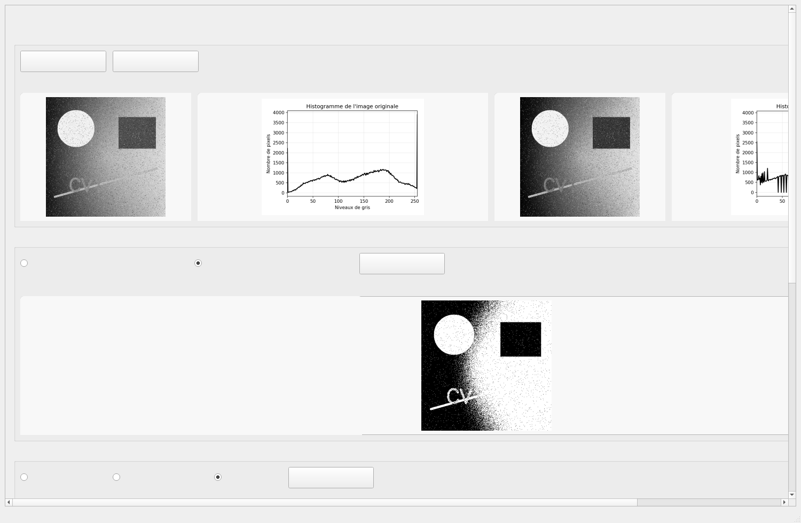
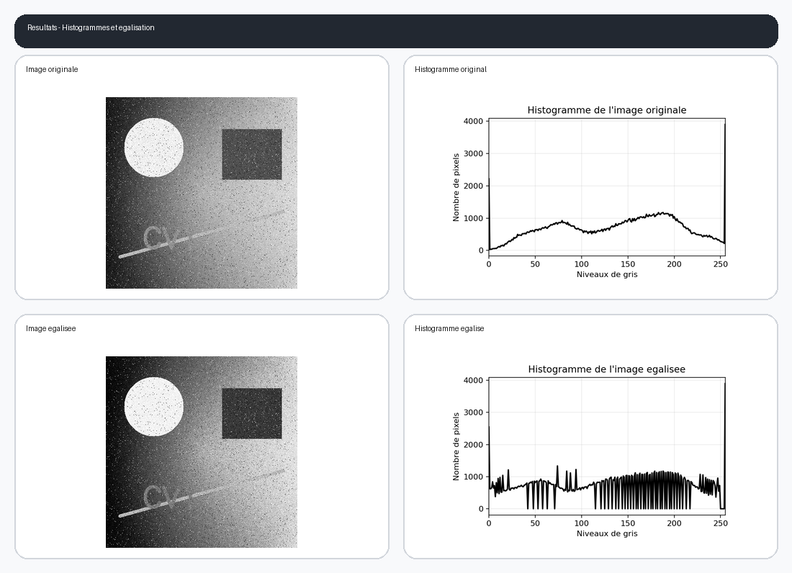
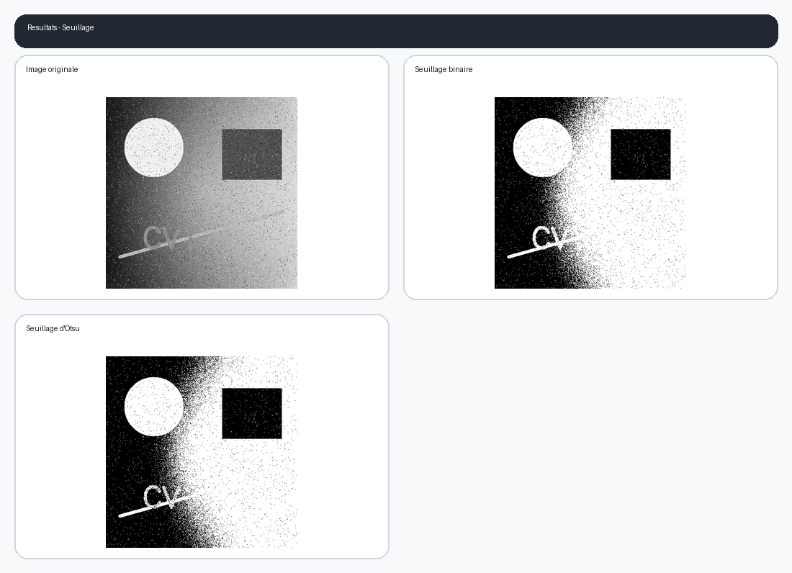
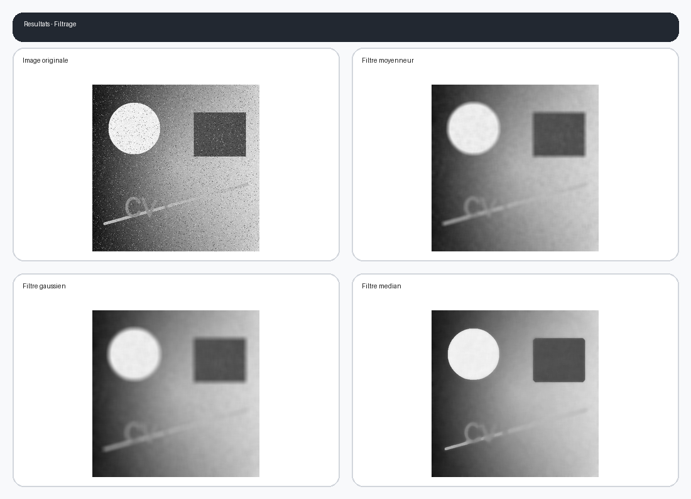
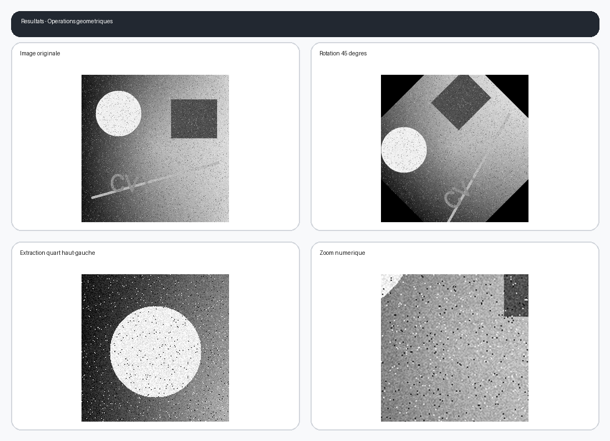

# Compte rendu detaille - TP2 Amelioration d'images

**Nom et prenom :** A completer  
**Section :** A completer (S3 ou S4)  
**Matiere :** Computer Vision 1  
**Sujet :** Histogrammes, seuillage, filtrage et transformations geometriques

## 1. Objectif du travail

L'objectif de ce TP est de developper une application de traitement d'images sous **PyQt5** et **OpenCV**. L'application permet a l'utilisateur de charger une image en niveaux de gris, d'observer son histogramme, puis d'appliquer plusieurs operations d'amelioration et de transformation. Le projet demandait une interface graphique complete et une logique de traitement liee aux boutons, radios et zones d'affichage.

## 2. Environnement logiciel utilise

- Python 3.13
- PyQt5 pour l'interface graphique
- OpenCV pour le traitement d'images
- NumPy pour la manipulation des tableaux
- Matplotlib pour le trace des histogrammes

## 3. Structure du projet

Le dossier du projet contient les fichiers principaux suivants :

- `design.ui` : interface creee sous Qt Designer
- `design.py` : code Python genere a partir de l'interface
- `main.py` : logique complete de l'application
- `requirements.txt` : dependances du projet
- `docs/Compte_rendu_TP2.pdf` : version PDF du compte rendu

## 4. Description de l'interface graphique

L'interface est organisee en quatre grandes parties :

1. **Importation et histogrammes**
   Elle contient le bouton `Parcourir`, le bouton `Appliquer`, l'image originale, l'histogramme original, l'image egalisee et l'histogramme egalise.
2. **Seuillage**
   Cette partie permet de choisir entre le seuillage binaire simple et le seuillage d'Otsu.
3. **Filtrage**
   L'utilisateur peut choisir entre le filtre moyenneur, gaussien et median.
4. **Operations geometriques**
   Trois operations sont disponibles : rotation, extraction et agrandissement.

## 5. Implementation de la logique

### 5.1 Fonction `makeFigure()`

Cette fonction utilitaire a pour role d'afficher dynamiquement une image dans un widget de l'interface. Elle convertit soit un tableau NumPy, soit un chemin d'image, en `QPixmap`, puis adapte l'affichage a la taille disponible tout en conservant les proportions.

### 5.2 Fonction `get_image()`

Cette fonction ouvre une boite de dialogue pour selectionner une image de type `.jpg`, `.jpeg` ou `.png`. L'image choisie est chargee en niveaux de gris avec `cv2.imread(..., cv2.IMREAD_GRAYSCALE)`. Ensuite, elle est affichee dans le widget `OriginalImg`, puis son histogramme est calcule et affiche dans `OriginalHist`.

### 5.3 Fonction `show_HistOriginal()`

Cette fonction calcule l'histogramme de l'image originale grace a `cv2.calcHist`. Le resultat est dessine avec Matplotlib puis enregistre sous le nom `Original_Histogram.png`.

### 5.4 Fonction `show_ImgHistEqualized()`

L'egalisation d'histogramme est realisee avec `cv2.equalizeHist`. L'image produite est sauvegardee sous le nom `Equalized_Image.png`. Ensuite, un nouvel histogramme est calcule et sauvegarde sous `Equalized_Histogram.png`. Les deux resultats sont affiches dans l'interface.

### 5.5 Fonction `show_ImgThresholding()`

Cette fonction applique l'une des deux methodes suivantes :

- **Seuillage binaire** avec un seuil fixe `T = 120`
- **Seuillage d'Otsu** avec calcul automatique du seuil optimal

Le resultat est enregistre sous `Thresholding_Image.png` puis affiche dans le widget `ThresholdingImg`.

### 5.6 Fonction `show_ImgFiltered()`

Cette fonction applique le filtre selectionne :

- Filtre moyenneur avec noyau `11 x 11`
- Filtre gaussien avec noyau `15 x 15` et `sigma = 10`
- Filtre median avec taille `13`

L'image filtree est sauvegardee sous `Filtered_Image.png`.

### 5.7 Fonction `show_ImgAugmented()`

Trois transformations geometriques sont implementees :

- **Rotation** de `45` degres autour du centre de l'image
- **Extraction** du quart superieur gauche de l'image
- **Zoom numerique** avec facteur aleatoire entre `1.5` et `4.0`, suivi d'un recadrage central

L'image finale est enregistree sous `Augmented_Image.png`.

## 6. Captures des resultats obtenus

### 6.1 Interface apres execution

### 6.2 Histogrammes et egalisation

### 6.3 Resultats du seuillage

### 6.4 Resultats du filtrage

### 6.5 Resultats des operations geometriques

## 7. Verification et tests

Le projet a ete verifie de plusieurs manieres :

- verification de la syntaxe Python
- test de chargement de la fenetre PyQt5
- generation automatique des images de sortie
- production du present compte rendu avec les captures correspondantes

## 8. Conclusion

Ce TP a permis de mettre en pratique plusieurs notions fondamentales de l'amelioration d'images : histogrammes, equalisation, seuillage, filtrage spatial et transformations geometriques. L'utilisation combinee de PyQt5 et OpenCV a permis d'obtenir une application interactive, claire et directement exploitable dans PyCharm.

## Lien GitHub

Lien GitHub a ajouter apres publication du depot
